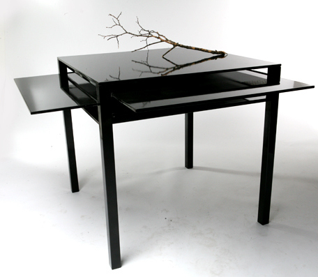

Hidden not forgotten is a table with 5 tabletops in one,  with option to expand in four directions. The distance between the tabletops makes temporary storage possible, and gives the ability to shift between different projects, push work inside the table to start up fresh with a new blank tabletop.
