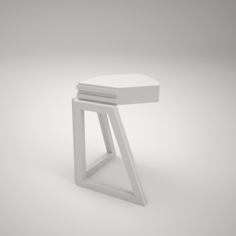
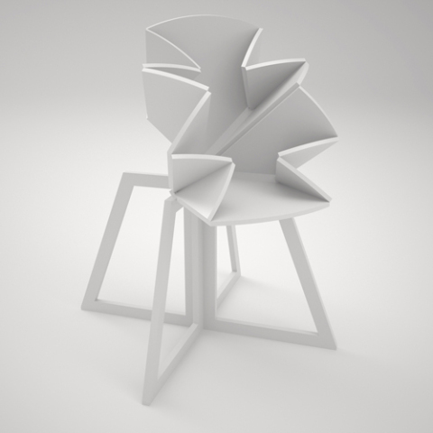
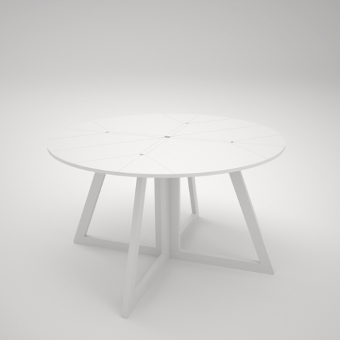

Grand Central is a collaboration between Sigrid Strömgren & Sanna Lindström. A collaboration that created an innovation – a new way of expanding a table.

Grand Central is an innovative foldable table that expands from a space saving occasional table to become the central piece of the room. The tabletop is divided into 22 pieces and the table expands through its advanced construction.The spectaculor transformation only lasts a few seconds, a short moment of poetry when the table folds out like an origami flower.

Exhibited at: D3 Contest – Talents selected 2010 IMM Cologne, Salone Satellite Milan 2010, Spazio Rossana Orlandi Milan 2010-2011, UNG8 – Young Swedish designers 2011-2012, Stockholm Furniture Fair 2011, Swedish design goes London – London Design Week 2011
