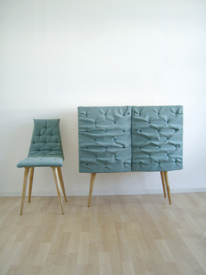
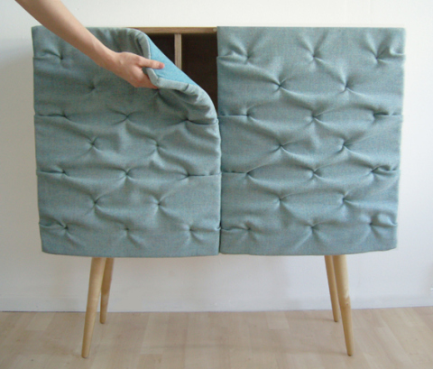

Eskimo Chair and Cabinet, design: Sigrid S

Eskimo Cabinet with built-in sound absorption, design: Sigrid S

The Eskimo collection was presented in Salone Satellite in Milan 2010.  The collection includes a chair and a sideboard, both covered in quilted upholstery. The acoustic door panels of the sideboard are soft and flexible and stay up with magnets. The sound-reducing element is a built-in function, not an after thought.

Exhibited in Salone Satellite Milan 2010, Spazio Rossana Orlandi Milan 2010-2011

