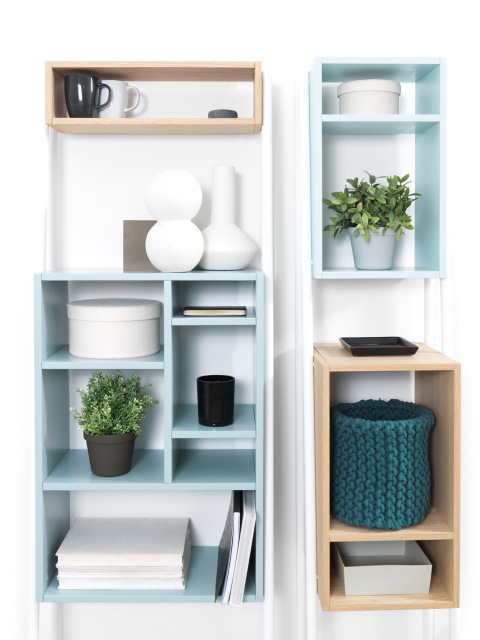
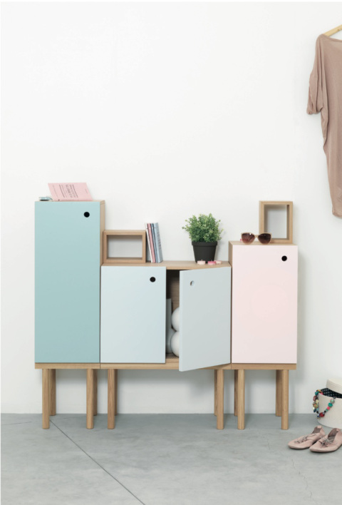
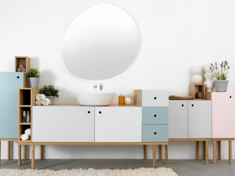

Still Life

The cabinet creates a Still Life of your everyday objects and collectables.

Collage Cabinet

Collage cabinet

Still Life and Collage cabinet is produced by the Italian bathroom brand Ex.t.

Still Life creates a still life of your everyday objects and most precious collectables well displayed and easy accessible.  This freestanding cabinet can fit  all the spaces of the home, as a single piece or together, filling up an entire wall.

Collage Cabinet is a mix between contrasting geometrical shapes, material properties and colour shades. Each cabinet of the family is different and can be combined with the others in various ways to create your very own collage.

Exhibited at Cersaie Bologna 2011, IMM Cologne 2012, Fuori salone Milano design week 2012