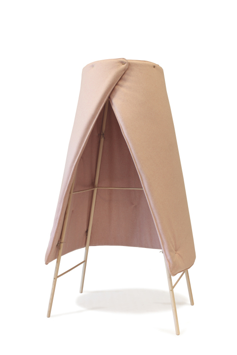
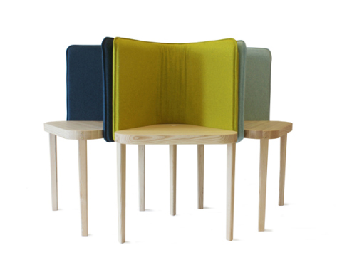
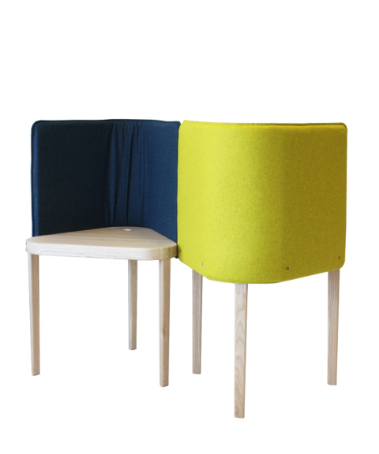
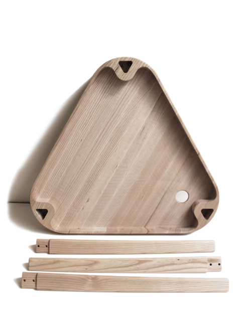

Noise-reduction is the startingpoint in most of Sigrid Strömgrens designs. In her latest project, unveiled at Superstudio Piú in Milan 2013, she takes care of the buzzy sound environment in open offices where the opportunity for privacy often is limited, and the sounds of other colleges voices is a distraction that is hard to escape..  

SNoise-reduction is the startingpoint in most of Sigrid Strömgrens designs. In her latest project, unveiled at Superstudio Piú in Milan 2013, she takes care of the buzzy sound environment in open offices where the opportunity for privacy often is limited, and the sounds of other colleges voices is a distraction that is hard to escape.

NOOK – A desktop/tablescreen that protects you from surrounding office noises. Due to its triangular shape NOOK is space efficient and easy to regroup and change spacial layout.

NOOK & TIPI is unveiled at the Swedish Pavilion, Swedish Design Goes Milan – NEW MAKERS & DOERS at Superstudio Piú, Via Tortona 27, Milan 9-14 April 2013.

Röhsska Museet, Göteborg 14-19 maj 2013